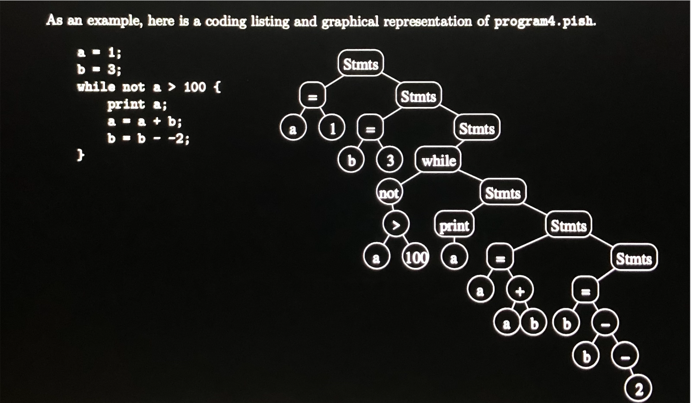

# Python-ish-Interpreter

A program that executes a pared-down version of Python (Pish, as Python-ish) using C++ compiler.

## Behind the Program

It is achieved by converting the Python-ish code into pieces of commands in a binary tree, and the program then executes the binary tree in post-order-traversal. Variables are stored in an open address hash table upon declaration.



## To Run

Download the files as a zip and unzip, then open up Terminal and locate the folder.

> Compile C++ 
```bash
make
```

10 sample Pish programs are available in the samples folder. To try out the interpreter, use command

> The 10 programs are each named program0~10.pish ex. program4.pish
```bash
./pish < samples/program0.pish
```

It executes the program first and prints the original code followed after. Have fun trying out!

